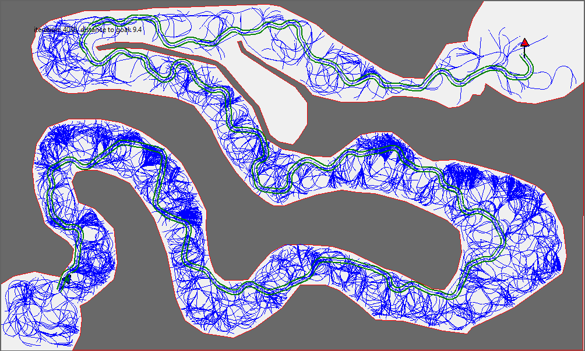

# Assignment3: Optimization of path planning for dubins car

## Getting started and interacting with the provided code
You are provided with a fully working implementation of an RRT path planning algorithm for dubins car. 

- Ensure that you have installed python 3, numpy matplotlib and scipy, tkinter, networkx
- Run the provided example with `python3 main.py`
  - A GUI window should appear running the RRT algorithm on a sample map.

There are several parameters in the code that can be modified including:

main.py:
- map name
- start position and rotation
- goal position and rotation
- number of iterations

rrt.py:
- min_turn - minimum turning radius of dubins car in pixels
- car_width - car width in pixels
- max_translation - maximum translation (local planner) of the car in a single time step
- min_translation - minimum translation (local planner) of the car in a single time step
- max_relative_rotation - maximum relative rotation of the car in a single time step (ie. a full loop results in 0 rad)
- max_abs_rotation - maximum absolute rotation of the car in a single time step (ie. a full loop results in 1 rad)
- turning_cost_scale - scalar on the rotation of the car when computing distance between poses
- goal_reached_threshold - distance (in terms of total cost) when considering whether the goal has been reached
- show_path - show the best path when done
- ignore_collisions - ignore collisions during planning
- debug - when enabled, additional debug info such as collision points are displayed

For your work, You may modify any part of the code as you see fit, however most of the changes will most likely be in main.py and rrt.py
  
## Aims for your code:

The aims for your code is to make one major improvement to the path planning algorithm that demonstrates your understanding of the algorithm, its strengths and weaknesses. This improvement should go behond simple parameter optimization, however this should be done within the scope of your improvement.

You should discuss how your improvement is affected by varying the independant model variables of the car (width and minimum turning radius). 

Suggested improvements:

- Time to reach the goal either in
    - number of iterations
    - computational complexity

- Post-process optimization
    - graph optimization - modify the tree to smooth the planned path (be mindful of obstacles)

- Dynamic model
    - Modify the dubins car model to consider dynamic constrains such as the forces on the car while turning.

